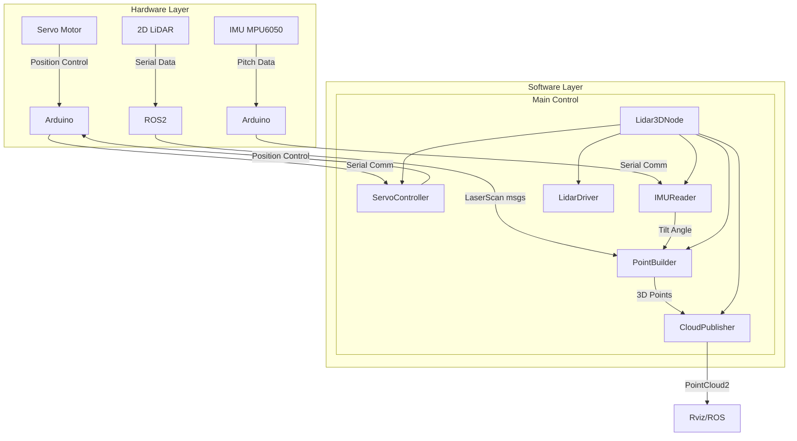
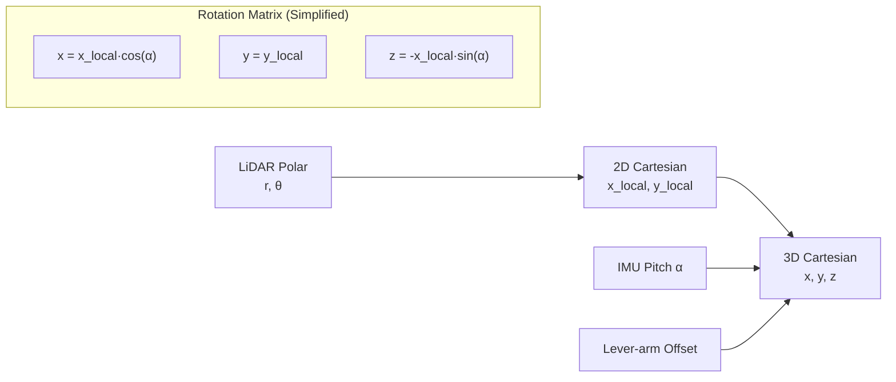

# 3D LiDAR Scanning System Description

## System Overview

This system creates a **3D point cloud** by mechanically tilting a **2D LiDAR** while using an **IMU** to measure the exact tilt angle. The system combines software and hardware components to achieve 3D scanning.

## System Architecture Mermaid Diagram



## Core Logic Flow

### 1. **Initialization & Calibration**
```
Power On → Servo moves to 90° → Wait 3s → IMU Calibration → Start Sweep
```
- Servo centers at 90° (horizontal)
- IMU samples current position to establish "zero" reference
- Offset is calculated: `offset = average(current_pitch)`

### 2. **Continuous Sweep Operation**
```python
while running:
    move_to(110°) → wait 1.2s → move_to(70°) → wait 1.2s → repeat
```
- Servo oscillates between 70° and 110° (40° total range)
- Each position allows LiDAR to capture a horizontal scan slice

### 3. **Data Processing Pipeline**
```
LiDAR Scan (2D) + IMU Tilt Angle → 3D Point Cloud
```

## Mathematical Transformations

### 2D to 3D Conversion

The system converts polar LiDAR coordinates to 3D Cartesian coordinates:

**Given:**
- `r` = LiDAR range measurement
- `θ` = LiDAR horizontal angle
- `α` = IMU tilt angle (pitch)

**Transformation:**
1. **2D LiDAR coordinates in local plane:**
   ```
   x_local = r * cos(θ)
   y_local = r * sin(θ)
   ```

2. **Rotation around Y-axis (tilt):**
   ```
   x = cos(α) * x_local + LIDAR_OFFSET_X * cos(α)
   y = y_local
   z = -sin(α) * x_local + LIDAR_OFFSET_Z
   ```

3. **Lever-arm compensation:**
   - Accounts for physical offset between LiDAR and rotation axis
   - `LIDAR_OFFSET_X` = horizontal displacement
   - `LIDAR_OFFSET_Z` = vertical displacement

### Binning System
- Tilt angles are rounded to nearest `ANGLE_RESOLUTION_DEG` (0.5°)
- Each bin stores points from one tilt position
- Old data in same bin is overwritten by new scans

## Coordinate Transformation Visualization



## Key Components

### **IMUReader**
- Continuously reads pitch from MPU6050
- Applies calibration offset: `current_pitch = raw - offset`
- Provides tilt in radians for calculations

### **ServoController**
- Sends angle commands via serial to Arduino
- Implements continuous sweeping motion
- Includes physical movement delays for realism

### **PointBuilder**
- Combines LiDAR ranges with tilt angles
- Performs 3D coordinate transformation
- Manages angle binning for data organization

### **CloudPublisher**
- Converts Python lists to ROS2 PointCloud2 format
- Publishes at configurable rate (10Hz default)
- Includes intensity field for visualization

## Physical Configuration

```
     ↑ Z
     │    LiDAR
     │     ┌─┐
     │     │ │← LIDAR_OFFSET_Z
     │     └─┘
     │      │
     │      │← Rotation Axis (Servo)
─────┼──────┼─────→ X
     │      │
     │      │← LIDAR_OFFSET_X
     │
```

## Performance Considerations

1. **Resolution Trade-offs:**
   - Angular resolution: 0.5° tilt bins
   - Max points: 200,000 (memory limit)
   - Publish rate: 10Hz

2. **Timing Synchronization:**
   - Servo movement: 1.2s per position
   - IMU sampling: 10ms intervals
   - LiDAR scan rate: ~10Hz (depends on model)

3. **Error Sources:**
   - Servo positioning accuracy
   - IMU drift over time
   - Lever-arm approximation
   - Timing jitter between measurements

This system creates a cost-effective 3D scanning solution by combining precise mechanical control with accurate sensor fusion and mathematical transformations.