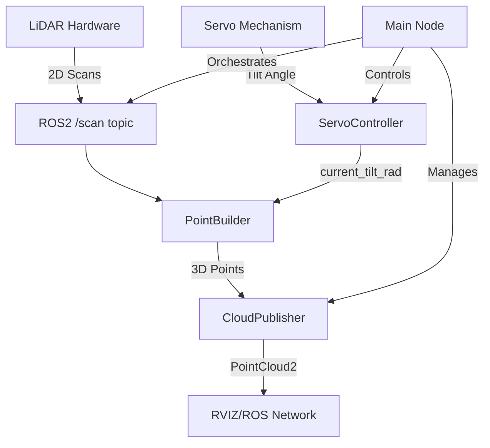
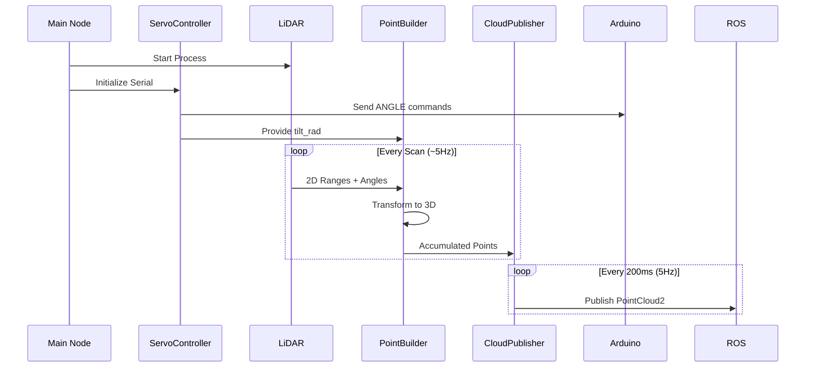
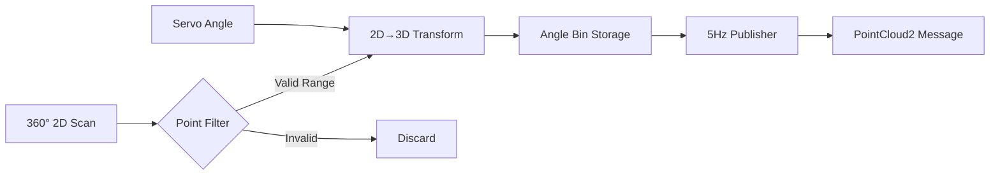

# 3D LiDAR Scanning System with Programmable Tilt Mechanism

## System Overview

This system creates a **3D scanning solution** by combining a 2D LiDAR (RPLIDAR C1) with a tilt mechanism. The servo rotates the LiDAR vertically while it scans horizontally, transforming 2D distance measurements into 3D point clouds.

## System Architecture



## Core Mathematical Transformation

### 2D to 3D Coordinate Conversion

The system performs a **Y-axis rotation transformation** on each 2D LiDAR point:

**Given:**
- 2D LiDAR range: `r` (meters)
- Horizontal angle: `θ` (radians)
- Tilt angle: `α` (radians, from servo)
- LiDAR offset from servo axis: `(offset_x, offset_z)`

**Transformation:**
```
1. Convert to LiDAR frame (2D):
   xl = r × cos(θ)
   yl = r × sin(θ)
   zl = 0

2. Apply tilt rotation + offset compensation:
   x = xl × cos(α) + offset_x × cos(α)
   y = yl
   z = -xl × sin(α) + offset_z
```

**Visual Representation:**
```
Before Tilt:      After Tilt:
   ↗ z              ↗ z (tilted)
   │                │   /
   │                │  /
   └───→ x          └───→ x
                    │
                    ↓ y (unchanged)
```

## Component Workflow



## Key Design Features

1. **Continuous Sweep Pattern**: Servo oscillates between -15° to +15° at 0.5° resolution
2. **Angle Binning**: Points grouped by tilt angle for memory efficiency
3. **Lever-Arm Compensation**: Accounts for physical offset between servo axis and LiDAR
4. **Thread-Safe Design**: Separate threads for servo control and ROS2 operations

## Data Flow Visualization



## Performance Characteristics

- **3D Points/Second**: ~108,000 (360 points × 60 tilt positions × 5Hz)
- **Servo Update Rate**: 33.3Hz (30ms intervals)
- **Angle Resolution**: 0.5° vertical, ~1° horizontal (LiDAR native)
- **Memory Usage**: Fixed buffer of 120,000 points (~1.1 seconds of data)

## Error Handling Strategy

The system implements **graceful degradation**:
1. **Serial failures**: Servo centers itself and closes port
2. **ROS2 node failures**: Clean shutdown with proper cleanup
3. **LiDAR process failures**: SIGINT → SIGTERM → SIGKILL escalation
4. **Thread safety**: Mutex locks prevent race conditions during shutdown

This design provides a **robust, production-ready** 3D scanning solution that transforms affordable 2D LiDAR hardware into a 3D scanning system through precise mechanical control and mathematical transformations.