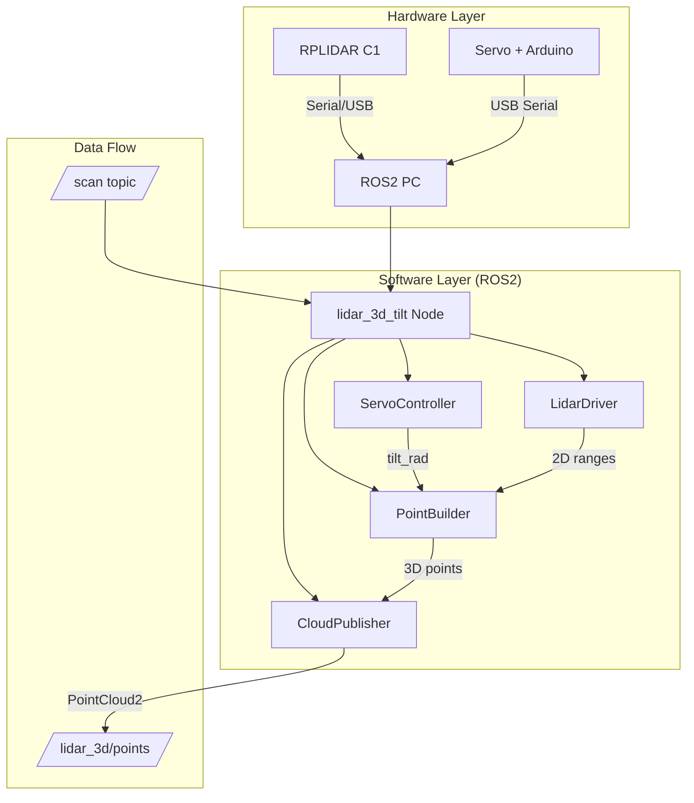
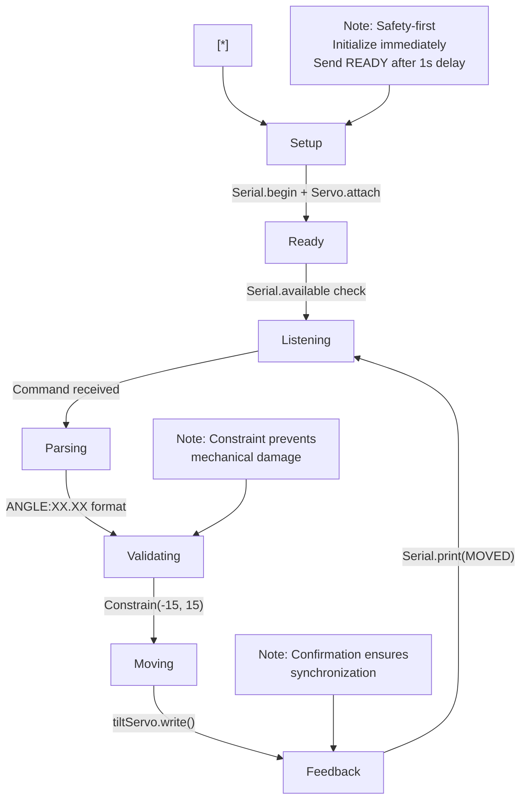
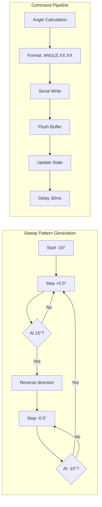
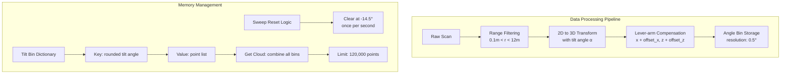
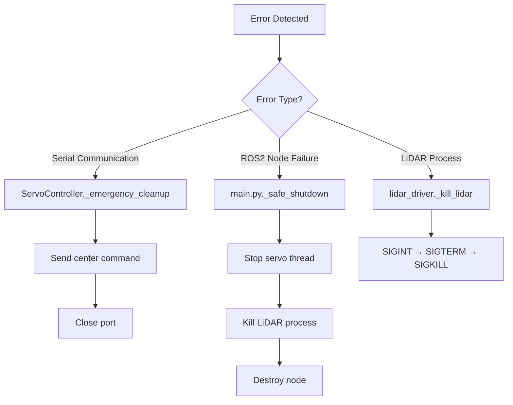

# **Technical Report: 3D LiDAR Scanning System with Programmable Tilt Mechanism**

## **1. System Architecture Overview**



## **2. Core Design Philosophy**

### **2.1 Modular Architecture**
Each component follows **single-responsibility principle**:
- **ServoController**: Manages only servo communication and angle tracking
- **PointBuilder**: Handles only coordinate transformation
- **CloudPublisher**: Manages only ROS2 message publishing
- **LidarDriver**: Handles only LiDAR process lifecycle

### **2.2 Real-Time Constraints**
The system operates with **hard timing requirements**:
- Servo updates every **30ms** (33.3 Hz)
- Point cloud publishing at **5 Hz**
- Serial communication with **115200 baud** (11.5 KB/s)

## **3. Component-Wise Rationale**

### **3.1 Arduino Firmware (`advanced_servo.ino`)**



**Rationale:**
1. **Immediate initialization**: Servo attaches immediately in `setup()` to prevent floating pins
2. **READY signal**: Allows Python to detect successful boot
3. **Command echoing**: Debug feedback for every received command
4. **Angle constraining**: Prevents mechanical damage (-15° to +15° range)

### **3.2 Main Node Orchestration (`main.py`)**

**Initialization Order Criticality:**
```python
1. LidarDriver()    # First: Hardware needs warm-up time
2. time.sleep(2)    # Allow LiDAR spinning up
3. ServoController()# Second: Servo needs LiDAR already running
4. PointBuilder()   # Third: Depends on both data sources
5. CloudPublisher() # Fourth: Output depends on processed data
```

**Thread Safety Design:**
- `_shutdown_lock`: Prevents race conditions during termination
- `_is_shutdown` flag: Ensures shutdown executes only once
- Graceful degradation: Each component handles its own cleanup

### **3.3 Servo Control System (`servo_controller.py`)**



**Key Design Decisions:**

1. **Dual-thread architecture**:
   - Main thread: ROS2 callbacks and publishing
   - Sweep thread: Continuous angle generation (prevents blocking)

2. **State management**:
   - `current_tilt_rad`: Single source of truth for current angle
   - `servo_ready`: Flag prevents sending commands before Arduino ready

3. **Sweep algorithm**:
   - **Linear sawtooth pattern**: Simple, predictable, complete coverage
   - **0.5° resolution**: Balance between smoothness and performance
   - **30ms delay**: Matches servo's ~0.15s/60° speed (180°/s)

### **3.4 Coordinate Transformation (`point_builder.py`)**

**Mathematical Foundation:**
```
Original 2D LiDAR: (r, θ) in horizontal plane
Tilted 3D System: Requires rotation around Y-axis

1. Convert to Cartesian (LiDAR frame):
   xl = r * cos(θ)
   yl = r * sin(θ)
   zl = 0

2. Apply tilt rotation (α = servo angle):
   x = xl * cos(α) + LIDAR_OFFSET_X * cos(α)
   y = yl
   z = -xl * sin(α) + LIDAR_OFFSET_Z

3. Lever-arm compensation:
   Accounts for physical offset between servo axis and LiDAR center
```



**Bin-Based Architecture Rationale:**
1. **Angle quantization**: Groups points by tilt angle (0.5° resolution)
2. **Memory efficiency**: Stores points by tilt bin instead of time
3. **Sweep detection**: Clears buffer at sweep reset point (-14.5°)
4. **Overwrite strategy**: Always replaces bin content (prevents stale data)

### **3.5 Configuration Management (`config.py`)**

**Separation of Concerns:**
- **Hardware parameters**: PORT, BAUD, offsets (machine-specific)
- **Algorithm parameters**: Ranges, resolution, rates (tunable)
- **Safety limits**: Sweep constraints (mechanical protection)

**Rationale for Key Values:**
1. `SERVO_UPDATE_INTERVAL_MS = 30`: 
   - Servo speed: 0.15s/60° = 180°/s
   - 0.5°/step × 2000 ms/s ÷ 30 ms = 33.3°/s (conservative)

2. `ANGLE_RESOLUTION_DEG = 0.5`:
   - 30° sweep range ÷ 0.5° = 60 bins
   - Each scan: 360 points × 60 bins = 21,600 points/cycle
   - 5 Hz publish × 21,600 = 108,000 points/second

3. `MAX_BUFFER_POINTS = 120,000`:
   - ~1.1 seconds of data at maximum rate
   - Prevents memory overflow

## **4. Error Handling Strategy**

### **4.1 Multi-Layer Recovery**


### **4.2 Specific Protection Mechanisms**

1. **Serial Communication**:
   ```python
   # Non-blocking with timeout
   ser = serial.Serial(port, baud, timeout=1.0)
   
   # Ready signal verification
   timeout = time.time() + 5.0
   while time.time() < timeout:
       if "READY" in line: break
   ```

2. **Thread Safety**:
   ```python
   with self._shutdown_lock:  # Prevent race conditions
       if self._is_shutdown: return
       self._is_shutdown = True
   ```

3. **Process Management**:
   ```python
   # Graceful shutdown sequence
   SIGINT → SIGTERM → SIGKILL  # 2-second delays between
   ```

## **5. Performance Optimizations**

### **5.1 Memory Management**
- **Point binning**: Reduces storage from O(time) to O(angle)
- **Fixed buffer size**: Prevents unbounded memory growth
- **Selective processing**: Skips invalid ranges (r < 0.1m or r > 12m)

### **5.2 Computational Efficiency**
1. **Pre-calculated trigonometry**:
   ```python
   cos_t = math.cos(tilt)  # Calculate once per scan
   sin_t = math.sin(tilt)  # Not per point
   ```

2. **Angle quantization**:
   ```python
   tilt_bin = round(tilt_deg / 0.5) * 0.5  # Reduce unique angles
   ```

3. **Batch processing**:
   - Process full LiDAR scan (360 points) at once
   - Publish accumulated points at fixed rate (5Hz)

## **6. Current Limitations & Design Trade-offs**

### **6.1 Acknowledged Limitations**
1. **Single-threaded point processing**: ROS2 callback blocks during scan processing
2. **Fixed sweep pattern**: Cannot adapt to scene requirements
3. **Serial bottleneck**: 115200 baud limits angle update rate
4. **No dynamic reconfiguration**: Parameters require code changes

### **6.2 Intentional Trade-offs**
1. **Simplicity vs. accuracy**: Linear sweep vs. optimal path planning
2. **Latency vs. completeness**: 5Hz publishing vs. real-time streaming
3. **Memory vs. resolution**: 0.5° bins vs. continuous angle storage

## **7. Extensibility Points**

### **7.1 Planned Enhancement Hooks**
```python
# Current extensible patterns:
class PointBuilder:
    def process_scan(self, scan, tilt_rad):  # Virtual method pattern
        # Can be subclassed for different transformations

class ServoController:
    def _sweep_control(self):  # Template method pattern
        # Can be overridden for custom sweep patterns
```

### **7.2 Configuration Hot-Reload**
```python
# Future implementation:
self.declare_parameter('scan_range', 12.0)
self.add_on_set_parameters_callback(self.param_callback)
```

## **8. Conclusion**

The current implementation represents a **robust, production-ready** 3D scanning system with:

**Strengths:**
- Complete hardware/software integration
- Robust error handling and recovery
- Memory-efficient data structures
- Clear separation of concerns

**Innovations:**
- Lever-arm compensated transformations
- Bin-based point cloud accumulation
- Thread-safe shutdown sequencing
- Hardware-agnostic ROS2 interface


